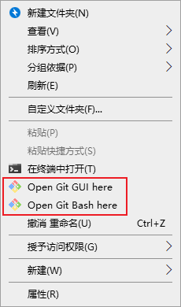

## 安装

**Git** 是一个免费、开源的 **分布式版本控制系统**，由 Linus Torvalds 于 2005 年创建，主要用于管理 Linux 内核的开发。它能够高效地处理从小型到大型的项目，具有速度快、灵活性高和强大的分支管理能力。

Git 目前支持 Linux/Unix、Solaris、Mac和 Windows 平台上运行。

Git 安装包下载地址为：[http://git-scm.com/downloads](http://git-scm.com/downloads)

安装过程便不多赘述。

## Git 工作流程

在使用git之前，我们应先了解一下使用git的工作流程。

如果把git比作写作业及上交作业的过程，可以分为以下部分。

**1. 工作区 (Working Directory) —— 你的书桌**

- 你在这里修改你的代码及文件。

- **意义**：在此处编写新功能或修复 Bug。

**2. 暂存区 (Staging Area) —— 你的书包**

- 当作业写得差不多了，你会把它放进书包里，准备上学。
- **意义**：告诉 Git，这些改动我确认要提交了，先帮我记着。

**3. 本地仓库 (Local Repository) —— 你的个人保险箱**

- 你把书包里的东西打包好，贴上标签（提交信息），锁进自己的保险箱。

- **意义**：改动正式成为了项目历史的一部分。即便你之后改乱了，也可以随时从这里找回。

**4. 远程仓库 (Remote) —— 老师的收件箱（如 GitHub/Gitee/GitLab）**

- 最后，你把保险箱里的代码通过网络发送给远程服务器，方便其他人查看或合作。

- **意义**：备份代码，并与团队共享进度，参与开源项目。

## 第一次使用git：在本地进行版本管理

### 打开git终端

在安装git后，我们可以在任意处右键，便能看到Git为我们添加到两个菜单。


这里我们打开第二个。


在这里就可以执行所有的git命令了。

### 初始化本地仓库

使用 **git init** 命令来初始化一个 Git 仓库。  注：.git文件是隐藏的，可以打开显示隐藏文件。


### 第一次提交

~~因为以下内容过于简单，所以不附图片~~

首先，我们为此项目添加一个文本文件。~~如果不会，请参考《像人类一样使用Windows》~~

第二步，将文件添加至缓存区

```终端
git add filename       # 将单个文件添加到暂存区
git add .              # 将工作区中的所有修改添加到暂存区
git status             # 查看哪些文件在暂存区中
```

最后，将暂存区里的文件推送至仓库。

```终端
git commit -m "Commit message" # 其中的 Commit message 请修改为对本次提交的说明
```

当然，你也可以在推送前及后进行以下操作。

```终端
git log                          # 查看提交历史
git diff                         # 查看工作区和暂存区之间的差异
git diff --cached                # 查看暂存区和最后一次提交之间的差异
```

## 参考教程及资料

[Git教程 菜鸟教程](https://www.runoob.com/git)

